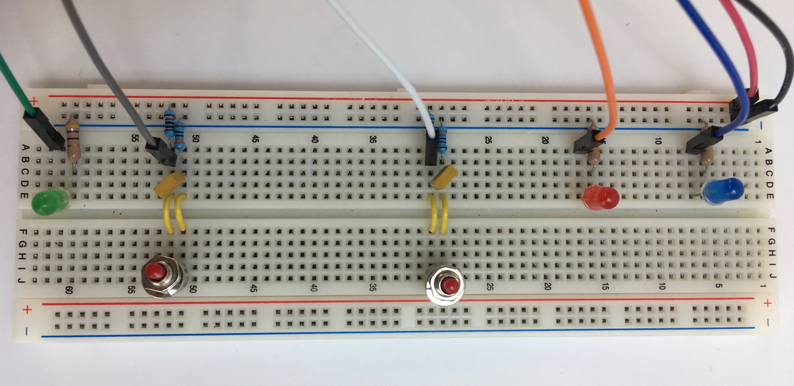
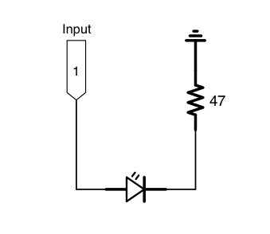
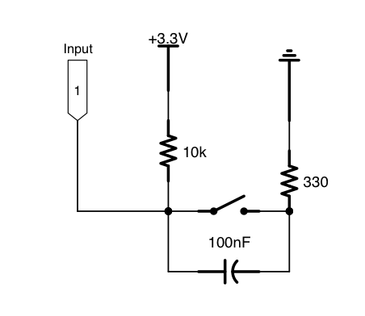

# Instrumented Classroom
## Senior Capstone Project for JN Matthews and Maureen Kalimba Isimbi

### Overview

Instrumented Classroom is an automated system to aid educational researchers
in the collections of audio and visual meta-data for how students interact in
group settings.  The current design generates a recording, a transcript, and
positioning data of students.

### Dependencies
* Hardware
    * Raspberry Pi 3 B
    * USB Microphone
    * USB Webcam

* Software
    * Python 3.6.7
    * OpenCV
    * [Google Speech-to-Text API](https://cloud.google.com/speech-to-text/)
    * Pyaudio
    * Numpy
    * Scipy
    * sounddevice
    * soundfile

### Set-up and Usage

#### Interface

There are three LEDs (above blue, red, and green), which respectively indicate
when the system is recording, busy, and active.  Each of these use the
following circuit diagram, where the recording LED connects to GPIO18, the busy
LED connects to GPIO23, and the active LED connects to GPIO24.

There are two switches, one which is used to start and stop recording and the
other to turn off the system when it is not currently recording or busy.  They
use the following circuit diagram, where the state toggling switch is connected
to GPIO17, and the power switch is connected to GPIO22.

#### Running the System

Once the interface, Raspberry Pi, and periphery sensors are configured, we need
to set up the keys for the Google Speech-to-Text API.  Once the API has been
set up with a GCS Account, we can download a .json file containing the
authorization credentials.  Place this file above the instrumented_classroom
repository and run the command: `sh setup_keys.sh`.

Now the system can be run by the command `python3 instr_class.py`.

#### Output

When run the instrumented classroom system will create a new directory based on
the current time stamp.  This folder will contain the following output files 
for each recording: `recording_n.wav` (the recording audio for the nth
recording), `position_info_n.json` (the facial positioning data for the nth
recording), and `transcript_info_n.json` (the audio transcription for the nth
recording).

The JSON object have the following format:

position_info_n.json:

    {"framerate": 30,
     "frames": [{"frame number" : 1,
                 "object positions": [{"object":"Person A", "position":[x, y, w, h]},
                                      {"object":"Person B", "position": [x’ , y’ , w’ , h’]},
                                       ...
                                     ]
                },
                ...
               ]
    }

transcript_info_n.json:

    [
        {"transcript": "this is a transcription", "confidence": 0.95 ,
         "word timings" :[{"word": "this", "start time":0.05, "end time": 0.27},
                         {"word": "is", "start time": 0.3, "end time": 0.41},
                         {"word": "a", "start time": 0.5, "end time": 0.72},
                         {"word": "transcription", "start time": 1.0, "end time": 2.0}
                        ]
        },
        ...
    ]

### Post Processing Analysis Tools

The output files generated for each session can be used as input to analysis
tools, of which there is a demo example in the analysis_tools subdirectory.

### References:

* Layout of Raspberry Pi GPIO Header:

* [Raspberry Pi GPIO documentation:](https://rpi.science.uoit.ca/lab/gpio/)
